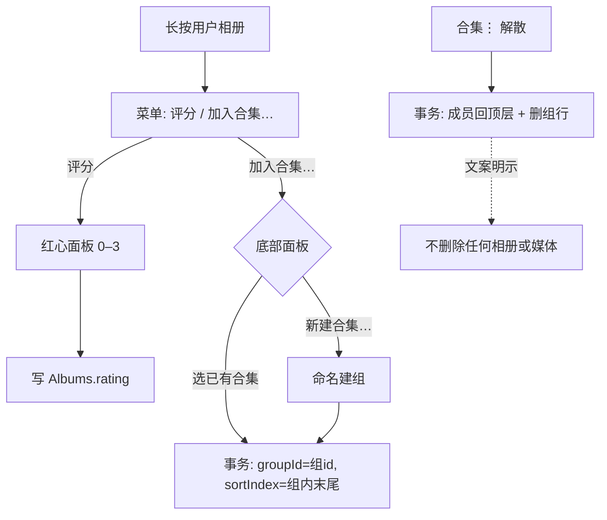

# 相册组织能力：评分 / 排序 / 列表模式 / 手动整理 / 合集

## 这个 Epic 要改变什么

把媒体已有的"评分 + 多级排序 + 偏好持久化"能力平移到**保险库相册（Invisible 页签）**这一层，并新增两个相册层独有概念：

1. 相册评分：0–3 红心，与媒体同一交互与不变量。
2. 相册排序：名称/创建时间/评分三族 × 升降序，多级组合，另加排他的"自定义顺序"。
3. 首页列表模式：马赛克之外新增 list 形态，全局持久化。
4. 手动整理：进入整理模式拖拽调整相册顺序（sortIndex）。
5. 合集（AlbumGroup）：把多个相册组成如"漫画系列"的合集，支持重命名、整体排序、组内排序、解散。

## 为什么现在做

用户以相册承载漫画等系列内容（一卷一相册），当前只有"名称序 + 置顶"无法表达卷序、系列归属与优先级；媒体层早已具备同类组织能力，相册层缺位造成体验断层。

## 来源 Vision

无（本项目尚未维护 `.cs/vision/`；本 epic 直接来自用户 2026-07-19 的确认需求）。

## 关联 Project Spec

- `.cs/spec/index.md`"能力地图/保险库浏览、界面与交互、统一语言"：本 epic 改变首页 Invisible 用户区的排序规则、卡片信息与形态，并新增合集实体；关闭后需回写这些章节。

## 当前方案

沿四条既有轨道扩展，不建平行体系：

- **数据**：Drift v5→v6 一次迁移。`Albums` 加 `rating`（0–3，默认 0）、`sortIndex`（NULL=未整理）、`groupId`（NULL=顶层）；新表 `AlbumGroups`(id/name/createdAt/sortIndex)。引用完整性沿现有惯例在仓库事务中手工维护，不加 SQL 外键。
- **排序**：新枚举 `AlbumSort` 镜像 `MediaSort` 的族规则与校验；比较器集中在新 `AlbumQueryUtils`（镜像 `MediaQueryUtils`）；排序职责从 AlbumRepository 上移到 application 层（repository 只出稳定基序数据）。
- **偏好**：新 `AlbumListPreferences`{sorts, multiSortEnabled, viewMode: mosaic|list} 单键 JSON 持久化（镜像 `MediaViewPreferencesController`；首页属全局层级，符合 AGENTS.md "home 设置 global" 不变量）。`albumColumns` 留在 AppSettings 不动。
- **UI**：长按菜单加"评分/加入合集"；⋮ 菜单（仅 Invisible 页签）加"排序/整理顺序"，样式面板加"列表"；新增 ArrangeScreen（顶层与组内复用）与 GroupScreen 两个普通 push 路由（自动被锁覆盖）。
- **备份**：manifest v2→v3，albums 条目加三个新键、顶层加 `albumGroups` 数组；导入放宽到 v3、向后兼容 v1/v2。

### 已确认决策（用户 2026-07-19）

1. 范围 = Invisible 保险库相册（Visible 系统文件夹不做）。
2. custom 模式下置顶**不再浮顶**（自动排序模式维持浮顶）。
3. 合集卡片角标 = 成员**相册数**（非媒体总数）。
4. v6 **一次迁移**带上合集表（不按里程碑拆两次）。
5. 默认排序 = 名称 A–Z，升级后首页观感不变。

## 需求变化

- 首页用户区顺序从"写死的 rank+名称"变为用户可配置（多级排序或手动序）；系统卡片位置不变（All → Fav → [用户区] → ＋新建 → 回收站）。
- 相册卡片新增红心角标；新增合集卡片形态。
- "文件夹组织"的统一语言扩充：合集、手动顺序、整理模式（见下）。
- 备份格式版本升至 3；旧版本 App 无法导入新备份（既有版本上限校验行为保持）。

## 界面与交互变化

### 合集浏览与管理增量（2026-07-19）

- Invisible 首页的列表模式提供显式的网格/列表切换按钮；原有 `⋮ → 样式` 入口继续保留。
- 合集详情同时支持马赛克与列表。列表模式按合集 id 隔离并持久化，不改变首页 Invisible 的形态偏好。
- 合集详情支持从屏幕右侧边缘向左滑切换到列表，从左向右滑回马赛克；手势只作为快捷入口，不能替代 AppBar 切换按钮。
- 首页列表中的合集行支持从右向左滑出合集管理入口；滑动不会直接执行解散，仍由管理面板中的确认流程完成。
- 合集 CRUD 入口完整可发现：Invisible 顶部菜单可独立新建空合集；合集详情可添加多个未入组相册、重命名、整理、解散；成员可移出或删除。

目标关系（目标状态）：

```text
Invisible 首页
┌ [Visible] [Invisible]     [网格/列表] [⋮] ┐
│  合集行  ──右向左滑──>  管理：添加 / 改名 / 整理 / 解散 │
│  点按合集 ────────────>  合集详情                    │
└───────────────────────────────────────────────┘

合集详情
┌ ←  合集名             [列表/马赛克] [+] [⋮] ┐
│  列表：缩略图  相册名  数量/红心       [⋯] │
│  马赛克：成员卡片，长按打开相册操作菜单    │
└ 右边缘左滑进入列表；左边缘右滑返回马赛克 ┘
```

### 目标界面 A：首页 Invisible（马赛克，含合集与评分）

- 角色与入口：解锁后默认页签。
- 图示状态：目标

```text
┌ [📷 Visible][🔒 Invisible]      🖼|▶  ⋮ ┐
│ ┌───────┐ ┌───────┐ ┌───────┐          │
│ │ All   │ │ Fav ♡ │ │▦≣ ①  │          │
│ │   123 │ │    45 │ │OnePiece 5│       │
│ └───────┘ └───────┘ └───────┘          │
│ ┌───────┐ ┌───────┐ ┌───────┐          │
│ │📌 ②   │ │       │ │  ＋   │          │
│ │Berserk│ │ Vol.9 │ │ 新建  │          │
│ │♥♥ 120│ │    57 │ │       │          │
│ └───────┘ └───────┘ └───────┘          │
│ ┌───────┐                              │
│ │🗑 回收站│                             │
└─────────────────────────────────────────┘
```

- ① 合集卡片：封面=首个成员封面 + 叠层图标；角标=成员相册数。② 相册卡片：rating>0 时名称左侧显示红心行。
- 交互与关键状态：长按相册 → 菜单新增"评分""加入合集…"；长按合集 → 重命名/整理顺序/解散；⋮（仅本页签）→ 排序 / 整理顺序 / 样式(3列/4列/列表)。
- 稳定约束：系统卡片顺序与"空相册隐藏"规则不变；照片 XOR 视频过滤继续作用于计数/封面；有成员但被过滤到 0 的合集随规则隐藏，0 成员空合集始终可见。
- 仅作示意：卡片内文案、图标具体选型、红心行像素位置。

### 目标界面 B：列表模式

- 图示状态：目标

```text
│ ▤  All Media                      123 │
│ ♡  Favorites                       45 │
│ ▦≣ OnePiece   ·合集·        5 相册 ▸ │
│ ▦  Berserk 📌  ♥♥♥            120 ▸ │
│ ▦  Vol.9                        57 ▸ │
│ ＋ 新建相册                           │
│ 🗑  回收站                          3 │
```

- 同一份条目数据换渲染；行=封面缩略图+名称+红心+数量；长按菜单与马赛克一致。

### 目标界面 C：整理顺序（ArrangeScreen，顶层与组内复用）

- 图示状态：目标

```text
┌ ←  整理顺序                    [保存] ┐
│ ▦ OnePiece ·合集·      5 相册     ⠿ │
│ ▦ Berserk 📌            120      ⠿ │
│ ▦ Vol.9                  57      ⠿ │
│    （拖动手柄调整；系统卡片不参与）      │
```

- SDK `ReorderableListView`，零新依赖；本地工作副本，[保存] 单事务写全部 sortIndex；顶层入口保存时同时把排序切为 `[custom]`；返回有改动需确认丢弃。

### 目标界面 D：合集详情（GroupScreen）

- 图示状态：目标

```text
┌ ←  OnePiece                        ⋮ ┐   ⋮ = 重命名 / 整理顺序 / 解散合集
│ ┌───────┐ ┌───────┐ ┌───────┐        │   成员长按 = 现有相册菜单 + 移出合集
│ │ Vol.1 │ │ Vol.2 │ │ Vol.3 │        │   成员点击 → 现有媒体网格
│ └───────┘ └───────┘ └───────┘        │
```

### 目标流程：合集关键交互



## 架构考量

- **排序职责上移**：AlbumRepository 停止排序（现 `_buildViews` 内写死），application 层派生 provider 组合"数据流 + 偏好"后经 `AlbumQueryUtils` 排序。理由：用户可配置排序属于视图策略，与媒体层现行分工（DAO 出数据、`MediaQueryUtils` 客户端排）一致。
- **`albumsProvider` 原样保留**：8 处 `ref.invalidate(albumsProvider)` 调用点不动；首页改watch新的派生 provider。
- **不加 SQL 外键**：groupId 悬挂在解散/删除事务中手工清理，与 `deleteUserAlbum` 处理 membership 的既有惯例一致。
- **排他 custom**：手动顺序必须是完全序，故 custom 与其他排序不可组合；也因此 custom 下置顶不浮顶（决策 2）。
- **零新依赖拖拽**：整理以列表形态进行（SDK ReorderableListView），不引入 reorderable-grid 包。
- **排序面板一个内核**：`GridAppMenu.showSortPicker` 内核抽成泛型，`MediaSort`/`AlbumSort` 两个薄包装；媒体面板行为必须不变。
- **合集不嵌套、不落库评分**：评分排序需要时用成员 max 计算。
- **合集详情形态隔离**：`collectionViewPreferencesProvider(groupId)` 按合集 id 持久化；不复用首页全局 `AlbumListPreferences.viewMode`，避免改变其它 Invisible 入口。
- **右滑只打开管理**：首页列表合集行使用 Flutter SDK `Dismissible` 的 `confirmDismiss` 入口并始终返回 false；手势不会直接执行解散。
- 被排除方案：Visible 系统文件夹纳入（无持久身份、不可改名）；DB 文件快照式备份（现行 manifest 逐字段导出是既有安全边界，只能扩展格式）。

## 质量约束与取舍

- **可靠性 / 数据完整性**：
  - 约束：v5→v6 迁移零丢失；解散/删除合集在任何路径下不删相册与媒体；整理/移组/解散均单事务，中断不产生半序或孤儿 groupId；备份"导出→清库→导入"往返保全评分/顺序/合集。
  - 取舍：不加外键换取迁移简单，用事务纪律补偿。
  - 继承：M1、M4 必须继承。
- **交互能力 / 用户差错防御**：
  - 约束：解散合集文案明示"相册将回到主页，不会删除任何内容"；整理未保存返回需确认；不提供"连同相册删除合集"入口。
  - 继承：M3、M4 必须继承。
- **可维护性**：
  - 约束：排序规则单一来源（AlbumQueryUtils）；偏好与 MediaViewPreferences 同构；不出现第二套"顺序"概念（置顶/自动排序/手动序的优先关系集中在一个比较器）。
  - 继承：M2 起全部继承。
- **性能效率（容量边界记录）**：
  - 约束：沿用"全量重建 + 75ms 防抖"模型；合集组装 O(相册数)，禁止 N+1（成员 count/cover 复用已算好的 AlbumView）。
  - 上限：相册上千且频繁变更时需改增量流；出现可感知卡顿即为升级触发。

## 统一语言

- **合集（AlbumGroup / collection）**：包含若干用户相册的组织单元，一层、不嵌套、无独立评分。关闭时并入 project spec 统一语言。
- **手动顺序（sortIndex）**：同级（顶层或组内）的用户自定义位置；NULL=未整理，排在已排序项之后按名称兜底。
- **custom（自定义顺序）**：`AlbumSort` 的排他模式，选中即单选、关闭多级；此模式下置顶不浮顶。
- **整理模式（ArrangeScreen）**：拖拽写 sortIndex 的编辑态；顶层保存会切换排序为 custom，组内保存不影响排序偏好。
- **ShelfEntry / GroupView**：首页用户区统一条目（相册或合集）及合集视图模型；仅本 epic 实现语境使用。

## 当前推进

### 可推进范围

实现已按依赖链完成，四个 issue 的执行记录与验证证据已写回；当前仍保持 active，等待用户按关闭条件进行人工路径确认后再关闭并回写 Project Spec。

全部四个里程碑的目标、范围、依赖、质量约束与验证均已清楚（设计经用户 2026-07-19 确认），按 M1→M4 顺序推进；M2/M3/M4 依赖 M1，M4 的 UI 依赖 M2/M3 的排序与形态基建。

### Issues

- [ ] `.cs/issues/2026/07/19/open-m1-album-organizer-data-layer.md`：schema v6 + 域模型 + 仓库/DB 方法 + 备份 manifest v3；迁移/DAO/备份往返测试。
- [ ] `.cs/issues/2026/07/19/open-m2-album-sort-and-rating.md`：AlbumSort/偏好/AlbumQueryUtils + 排序面板泛化 + 相册评分 UI 与角标。
- [ ] `.cs/issues/2026/07/19/open-m3-album-list-mode-and-arrange.md`：列表模式 + ArrangeScreen + custom/置顶语义。
- [ ] `.cs/issues/2026/07/19/open-m4-album-collections.md`：合集 CRUD UI + GroupScreen + 组内整理。

### 暂停或废弃

- 无。

### 剩余阻碍

- 无（工具链已验证：Flutter 3.44.6 可用，host 端测试可跑）。

## 暂不推进范围

- Visible 系统文件夹的排序/列表/元数据（另立需求再议）。
- 合集嵌套、合集独立评分、组内自动排序（各有升级触发，见各 issue 有界简化）。
- 马赛克网格内直接拖拽（触发：列表形态整理体验不足 → 引入 reorderable-grid 依赖）。
- 自然数字排序（Vol.2 vs Vol.10；M2 实施时评估一句成本后再定）。
- 合集封面手选。

## 未确认问题

- 无（五个关键决策已于 2026-07-19 由用户确认，见"当前方案"）。

## 关闭条件

- 四个 issue 全部关闭，各自验证与质量目标证据齐备。
- `make analyze && make test` 全绿；媒体排序面板与锁覆盖回归不变。
- 手动路径确认：评分→按评分排序；整理→custom 顺序稳定；建组/改名/组内排序/解散全流程；备份导出→导入往返。
- 用户人工确认关闭。

## 合并回 Project Spec 的候选

- 首页 Invisible 的新排序规则、列表模式、合集能力 → `.cs/spec/index.md` 能力地图 + 界面与交互（当前图更新）。
- 统一语言：合集 / 手动顺序 / custom 排他 / 整理模式。
- 质量约束：备份 manifest v3 兼容策略；"解散不删内容"护栏；性能容量边界。
- Schema v6 与迁移事实 → 架构落点/证据索引。

## 关闭回写

- 状态：（关闭时改为 `closed`）
- 合并位置：
- Vision 同步：无来源 Vision；若届时已建 Vision，补充"相册组织"能力区实现状态。
- 保留材料：本 spec 的目标线框图与决策记录。
