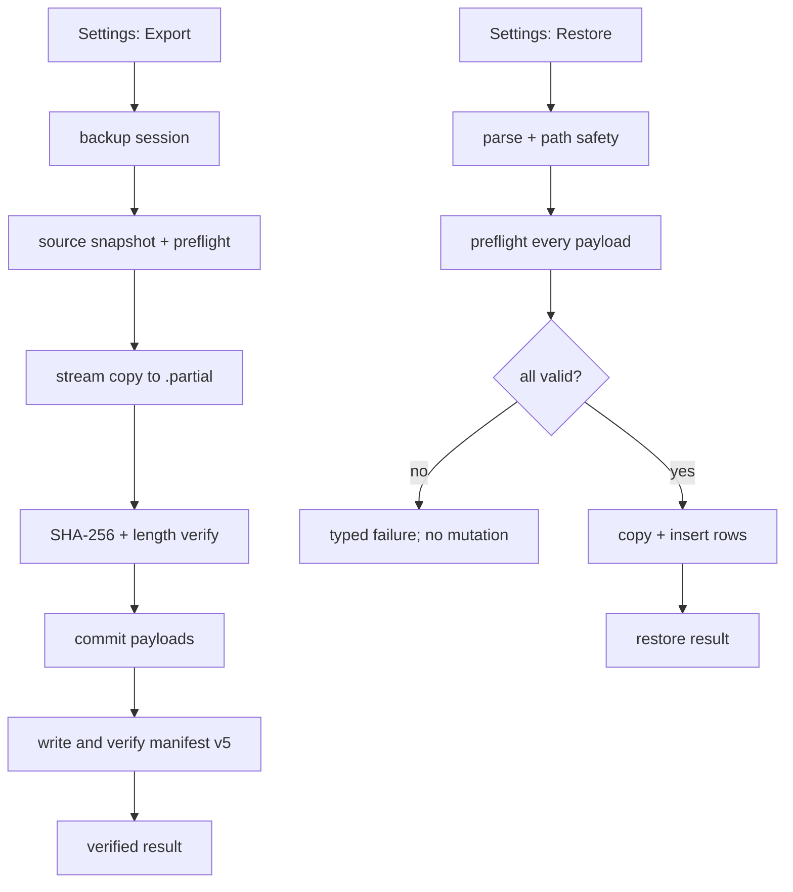

# Verified local backup and restore preflight

## 目标

让本地导出真正成为可相信的保险库副本：导出只有在每个媒体源都存在、
副本长度与 SHA-256 校验通过、最终清单写完后才报告成功；恢复先对清单和
全部媒体做只读预检，发现缺失、损坏或路径不安全时不改变当前保险库。
移动端在长任务中显示当前阶段、已处理数量和当前文件，取消或失败都明确
报告，不把部分结果伪装成完成。

## 范围

- 包含：`VaultBackupService` 的流式校验、manifest v5 校验字段、导出/恢复
  进度与合作取消、恢复预检、设置页的进度/错误状态、英文与中文本地化、
  服务和 widget 测试、相关设计与研究文档。
- 不包含：云同步、加密或恶意篡改防护、定时任务、增量备份、重复内容管理、
  缩略图重建算法。缩略图仍是可重建缓存，不阻断原始媒体备份。
- 兼容：继续导入 manifest v1–v4；新导出使用 v5。旧清单没有校验字段时，
  恢复仍执行路径、存在性和非空检查，但不能声称经过 checksum 验证。

## 归属

- 独立 issue；相关当前真相：`.cs/spec/index.md` 的备份/恢复与质量约束。
- 研究依据：`docs/05-review/feature-research-2026-07-22.md`。
- 相关决策：`docs/decisions-log.md` 的 D3 本地导出/导入。

## 背景与证据

当前设置页选择目录后直接调用 `VaultBackupService.exportToDirectory`。服务遍历
活动和回收站行，源文件不存在时 `continue`，仍写 manifest 并返回已复制数量；
它不计算导出副本 digest。恢复端只检查目标文件非空，再信任清单中的
`contentDigest`。因此成功 snackbar 不能证明清单完整或字节正确。Google Photos
官方把整体/逐项备份状态和“检查备份是否完成”作为显式用户路径；RFC 8493
则把“清单文件全部存在且每个 checksum 通过”定义为完整且有效的包。

## 现状如何工作

用户从 Settings → Storage → Export vault 选择目录后，设置页调用备份服务。服务
读取活动与回收站媒体、相册、合集和 membership，逐项把媒体拷贝到 `media/`，
最后写 `privi_manifest.json`；异常直接回到设置页 snackbar。Restore vault 走相同
目录选择，服务解析 manifest，创建相册/合集，逐项把文件放进本地 vault，再插入
媒体行和 membership。缩略图属于可选缓存，缺失时不会阻断媒体行恢复。

## 影响范围

### 必须修改

- 备份服务的源文件预检、流式 digest、临时文件提交、manifest v5、恢复预检与
  取消结果。
- Settings 的导出/恢复执行状态、进度弹窗、错误映射和本地化文案。
- 备份服务测试：缺失源、源变化、导出副本损坏、清单缺失/路径穿越/错误 digest、
  旧版本兼容、取消，以及预检失败无副作用。

### 需要验证

- v1–v4 恢复行为和既有 path-safety 校验不回归。
- Android shared vault 与 iOS app-private vault 的目标路径策略不变。
- 大文件使用流式读取，不把视频整体载入内存；锁覆盖层、设置页返回和错误 snackbar
  在进度弹窗期间仍可预测。
- 现有 backup round-trip、migration、maintenance 与 settings widget 测试继续通过。

### 仍待调查

- 真机上外部目录提供者在低存储、断电或权限撤销时的具体错误码和恢复文案。
- macOS/iOS 真机上的 document picker、App Group vault 目录与 checksum 运行时间。

## 质量目标

- **可靠性 / 可恢复性**（来源：Project Spec、D3、风险扫描）：导出不能静默
  丢弃清单中的媒体；每个 v5 payload 都有可验证 SHA-256；恢复预检失败时当前
  DB、vault 文件和 membership 均不改变。证据：故障注入测试、manifest 往返测试、
  预检前后快照断言和真实设备腐坏一个字节的手动路径。
- **交互能力 / 用户差错防御**（来源：移动 UX 研究）：长任务显示阶段、`done/total`
  和当前文件；取消只产生明确的 cancelled 结果；失败指出可修复的文件/阶段，
  不把原始异常字符串当作 UI 文案。证据：widget 状态测试、窄屏截图/语义检查。
- **性能效率 / 时间特性**（来源：MVP 几千媒体约束）：digest 和复制按流处理，
  不建立整文件内存缓冲；批处理期间 UI 仍可渲染进度。证据：大文件测试及代码审查
  确认 `openRead` 流路径。
- **兼容性**（来源：现有备份契约）：v1–v4 清单仍可恢复；v5 才要求 checksum
  字段，并明确旧清单的验证能力边界。证据：版本化 fixture 测试。

## 实现设计

### 这次要怎么做

继续让 `VaultBackupService` 作为唯一备份责任模块，但把“拷贝媒体”和“证明拷贝
可用”合并为一个深接口。导出先读取稳定快照并预检所有原始媒体，再逐项写入
临时文件、计算副本 SHA-256、验证长度和已存在的源 digest，全部通过后才提交
每个 payload 与最终 manifest。恢复先完整预检 manifest、路径、存在性、非空、长度
和 v5 digest，预检全绿后才创建任何相册、复制任何媒体或插入任何 DB 行。版本
低于 v5 的备份保留现有兼容路径，但 UI 明确只称“已检查”，不称“checksum 已验证”。

服务对外只增加一个不可变进度回调、一个取消 session 和一个结果对象；调用方不
需要知道临时文件、hash 算法或版本分支。所有原始媒体用 `File.openRead()` 流式
处理，复用现有 `crypto` 依赖；不新增包或平台 channel。

### 功能怎么分工

- `VaultBackupService` 负责快照、路径安全、checksum、版本兼容、临时提交和恢复
  预检；任何完整性失败都抛出带 code 和媒体名的 typed error。
- `VaultBackupProgress` / `VaultBackupSession` 只表达阶段、数量、当前文件和取消
  请求；不持有 UI 或本地化字符串。
- Settings 负责选择目录、显示 progress dialog、禁用重复入口和把 typed error
  映射为 l10n；异常细节写 debug log，不直接显示堆栈。
- 缩略图继续作为可丢弃缓存：manifest 可以列出它，但缺失只触发可重建状态，不能
  让原始媒体成功数失真。

### 请求 / 数据怎么走



导出 manifest 记录 `sha256`（base64url SHA-256）、实际 byte length、媒体元数据和
组织关系；原有 `contentDigest` 继续保留用于应用内身份。恢复 v5 时重新计算
backup payload digest，并在写入 vault 后再验证目标文件；v1–v4 走兼容校验。

### 移动端状态与线框

目标：Settings → Storage 的入口不变，长任务由阻塞但不可误触的弹窗承载；核心
信息只出现一次，当前文件可截断但不溢出窄屏。

```text
┌─ Export vault ─────────────────┐
│ Checking source   3 / 124      │
│ IMG_0421.jpg                   │
│ ━━━━━━━━━━━░░░░░░░░            │
│                         Cancel │
└────────────────────────────────┘
                 ↓
┌─ Backup verified ──────────────┐
│ 124 items · 8.4 GB              │
│ SHA-256 checked                 │
│                         Close   │
└────────────────────────────────┘
```

恢复预检复用同一弹窗并把阶段改为 `Checking backup`；校验失败时保留设置页，显示
失败媒体名与 `Retry`，不自动继续写入。取消发生在下一项边界，已提交的 payload
仍由旧 manifest 隔离；恢复取消返回已恢复数量和 cancelled 标志，用户可安全重试。

### 哪些边界不碰

- 不声称加密、抗恶意篡改或持续健康检查；“verified”只表示本次清单和 bytes 在
  指定时间通过校验。
- 不删除用户选择目录中的旧文件或清理孤儿 backup payload；manifest 是唯一有效
  集合，避免导出覆盖造成不可逆数据删除。
- 不把 `contentDigest` 不存在的旧 Android 行当作重复项，也不在本 issue 引入
  duplicate review。
- 不把缩略图缺失当作原始媒体失败；恢复后沿既有机制重建。

### 有界简化

- 当前按媒体项而非字节显示进度；单个超大视频在 hash/copy 期间计数不会变化，
  但当前文件会保持可见。升级触发是用户报告单文件长时间无反馈；届时把进度模型
  扩展为已处理 bytes，而不改变服务的 checksum 接口。
- v5 使用单个 SHA-256 字段，不采用完整 BagIt 目录；升级触发是需要跨工具交换或
  签名验证，届时再引入标准包格式/签名层。

### 质量目标如何落实

- 可靠性：所有 payload 先预检、再临时写入和 digest 验证，manifest 最后提交；
  restore preflight 在任何 DB/文件副作用前完成。
- 交互：进度对象是不可变且可本地化，dialog 防重复点击和误关闭；typed error
  提供可修复动作。
- 性能：`openRead` 流和逐项处理限制内存；取消检查位于项目边界，避免半写文件被
  当成完成。
- 兼容性：读取版本上限升到 5，旧版本分支保持；新字段缺失时能力边界明确。

### 一步步怎么改

1. 在备份服务内加入不可变 progress/result/error 类型和流式 digest helper，先补
   缺失源与错误 digest 的服务测试。
2. 改导出为 v5：预检快照、临时 payload、校验、manifest 最后提交；补 source 变化、
   corrupt copy 和取消测试。
3. 改恢复为全量只读 preflight，再进入现有 album/media restore；补 missing payload、
   wrong length/digest、path traversal 与 no-mutation 测试，并保留 v1 fixture。
4. 增加 Settings progress dialog、取消/错误映射和英文/中文文案；补窄屏 widget
   状态与重复点击测试。
5. 运行格式、analyze、全量测试、debug APK；在可用 Android/iOS 真机验证正常、
   低存储/中断和手工篡改一个字节的路径。

### 怎么确认做对

- 服务测试证明缺失源、源在读取后变化、临时副本错误、manifest 缺失/损坏、digest
  错误、取消和路径穿越都显式失败；失败前后 DB 行、membership、vault 文件和
  旧 manifest 快照不变。
- widget 测试证明阶段/进度/当前文件/取消状态可见，长文件名在 360dp 宽度不溢出，
  设置入口在运行期间不会重复启动第二个任务。
- `flutter analyze`、`dart format --set-exit-if-changed`、`flutter test`、
  `flutter build apk --debug` 通过；真机导出后用外部工具改一字节，Restore 应在
  写入前拒绝并指出文件。

## 执行记录

- 2026-07-22：基线审计确认 `main` 无未提交改动、无开放 GitHub PR/issue；
  `flutter analyze`、格式检查、`git diff --check` 和 207 项测试通过。
- 2026-07-22：第一方研究选择本 issue 为 P0；研究与来源见
  `docs/05-review/feature-research-2026-07-22.md`。
- 2026-07-22：导出改为 manifest v5。活动媒体、回收站媒体、相册、合集和
  membership 在一个 Drift transaction 中形成不可变快照；源文件先做存在性、
  非空、长度和 SHA-256 预检，再流式写入临时文件并校验，最后提交 payload 与
  manifest。任何失败只回滚本次新文件，不覆盖目标目录已有内容。
- 2026-07-22：恢复拆成 manifest 读取、只读 preflight 和安装三个阶段。v5 在写入
  前校验 summary、路径、文件长度/digest、ID 唯一性及 cover/group/membership
  引用；相同 media ID 只有在现有 vault 文件长度和 digest 一致时才跳过，否则
  返回 `destinationConflict`。DB 写入失败或取消会回滚本次安装文件和事务。
- 2026-07-22：Settings 增加不可误关的进度弹窗、合作取消、完成/失败/重试状态，
  失败显示本地化阶段与具体 item。目录 picker 通过 provider 注入，picker 异常以
  可重试 snackbar 呈现；restore 成功后才刷新相册与 vault size provider。
- 2026-07-22：备份实现收敛为 facade 与内部 export/manifest/restore 模块；
  manifest codec、parser、组织解析和引用校验分离，但调用方仍只依赖
  `VaultBackupOperations` 的两个操作。历史 v2/v3/v4 fixture 分别取自真实提交，
  与 v1 fixture 一起固定旧格式兼容边界。
- 2026-07-22：双轴复审确认稳定 DB snapshot、v5 组织引用校验、copy failure
  stage、相同 ID destination conflict 和 controller 状态覆盖已闭环；随后补上
  malformed manifest item 与 directory picker failure 两条 UI 错误路径。进度回调
  明确是非业务 observer：异常写 debug log，但不得在 manifest/DB 已提交后反转
  export/restore 结果或触发错误回滚。

## 验证

2026-07-22 已完成的自动化证据：

- 可靠性/可恢复性：
  `timeout 240s flutter test test/data/vault_backup_service_test.dart`，35 项通过。
  覆盖缺失/空源、记录 digest
  错误、源在 preflight 后变化、目标冲突、最终验证失败回滚、缺失/损坏 payload、
  路径与 symlink 防护、引用损坏、同 ID 内容冲突、DB 失败与取消无残留。
- 交互能力：controller 5 项、备份 dialog 5 项、Settings 12 项通过；覆盖 360dp
  长文件名、阶段/计数、取消防重复、完成、typed error、retry、picker 失败和入口
  busy 禁用。全量测试已包含这些路径。
- 性能效率：2 MiB payload 测试通过；实现只使用 `File.openRead()` 流式 hash/copy，
  不读取整文件到内存。进度当前仍按媒体项更新，单个超大文件期间只显示当前文件。
- 兼容性：真实 v2/v3/v4 fixture 与 v1 fixture 恢复测试通过；旧版本结果明确返回
  `checksumsVerified: false`，未知更高版本被拒绝。
- `flutter gen-l10n`：通过。
- `timeout 240s flutter pub run build_runner build`：通过，写出 219 个确定性产物；
  工具提示当前 SDK language version 新于锁定 analyzer language version，未阻断生成。
- `dart format --output=none --set-exit-if-changed lib test`：206 个文件、0 变更。
- `flutter analyze`：通过，0 issues。
- `git diff --check`：通过。
- `timeout 300s flutter test --reporter failures-only`：251 项全部通过。
- `timeout 240s flutter build apk --debug`：通过，产物
  `build/app/outputs/flutter-apk/app-debug.apk`；Gradle 提示若干现有 plugin 未来需迁移
  Built-in Kotlin，未阻断本次构建。

仍需真机证据，issue 因此保持 open：

- Android/iOS 正常导出、恢复、取消与长任务前后台切换。
- 低存储和目录权限在任务期间撤销。
- 用外部工具修改真实 payload 一个字节，确认恢复在任何 DB/vault 写入前拒绝并显示
  失败文件。

## 关闭回写

已把当前实现事实和稳定边界回写 `.cs/spec/index.md` 与
`docs/03-architecture/data-model.md`。按媒体项进度的已知上限继续留在本 issue；
升级触发仍是单个大文件长时间无反馈，升级方向是在现有 progress 模型增加 byte
进度而不改变 checksum interface。普通独立 issue 不改写 Vision。
