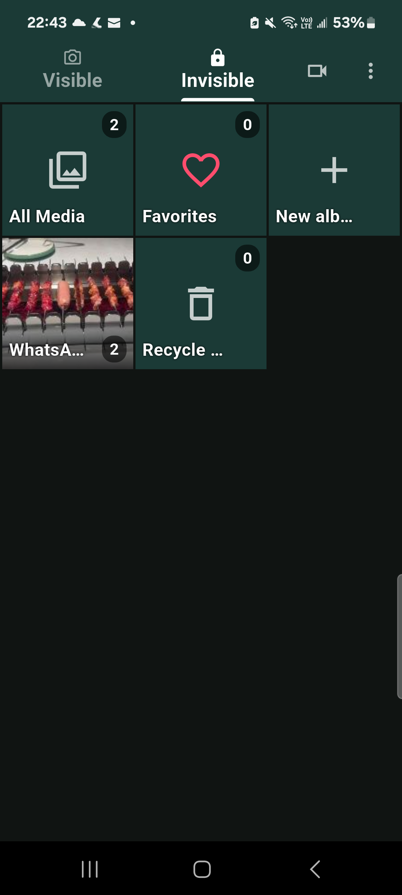
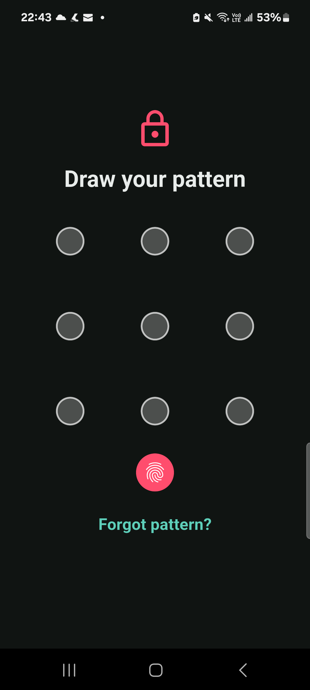
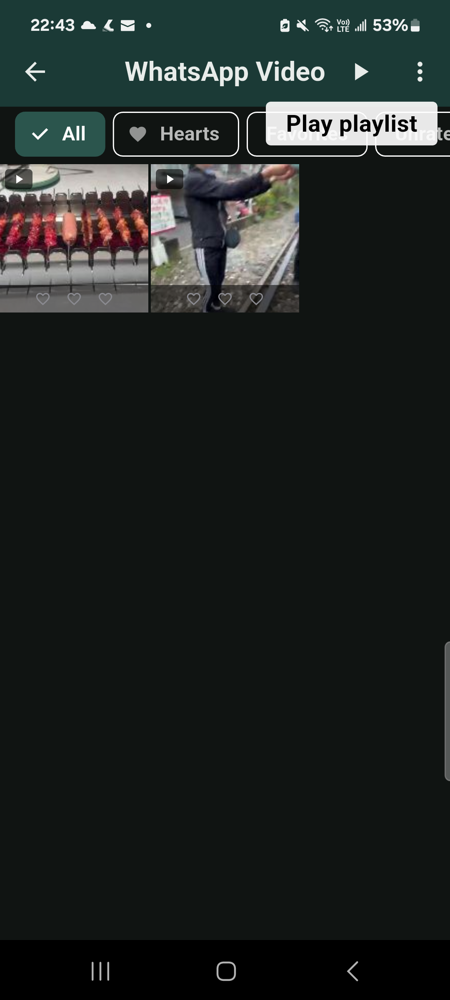
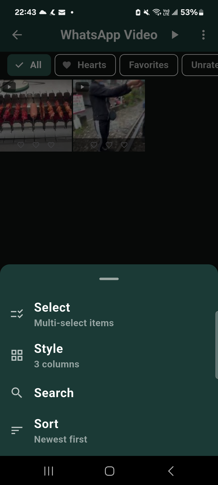
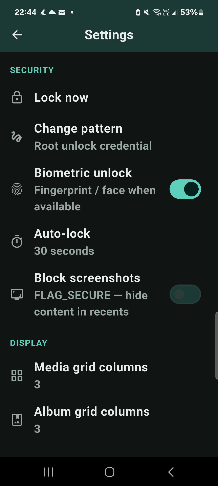

# Privi

Personal, on-device **Android media vault**. Hide photos & videos from the system
gallery, rate them **1–3 hearts**, favorite, play playlists (built-in or
**VLC**), and lock the app with **pattern / PIN + biometric**. Dark theme only.
Sideload-only — media stays local; no cloud storage, accounts, or analytics.

**Author:** [kcng0](https://github.com/kcng0) · **License:** [MIT](./LICENSE) · **Support:** [Buy Me a Coffee](https://buymeacoffee.com/kcng0).

This is a personal project; simplicity is favored over features.

---

## Install (APK)

Privi is not on Google Play. Download a release APK and sideload it:

1. Open the latest **[Release](https://github.com/kcng0/privi/releases/latest)**.
2. Download `privi-<version>.apk` (and optionally `SHA256SUMS`).
3. Verify the download (desktop):
   ```bash
   sha256sum -c SHA256SUMS
   ```
4. On your phone, allow install from your browser/file manager if prompted.
5. Open the APK and install.

Each release includes:

| Asset | Purpose |
|-------|---------|
| `privi-<version>.apk` | Sideload install |
| `SHA256SUMS` / `.sha256` / `CHECKSUMS.txt` | Integrity check |
| **Source code (zip / tar.gz)** | Auto-attached by GitHub for the tag |

**Requirements:** Android 8.0+ (API 26). Optional: [VLC](https://www.videolan.org/)
for external video playback. All media stays on-device.

> Official GitHub Release APKs are **release-signed** with a permanent keystore
> (same signature across versions). First-time installs of a new signature may
> still get a Play Protect “unknown app” prompt until Google has seen the
> binary — use **Install anyway** and leave harmful-app detection enabled.

### Hot updates

Starting with **v1.0.3**, release APKs include Shorebird code push. Install that
base APK once; compatible signed Dart patches then download in the background
and take effect after the next app restart. The About dialog shows both the base
version/build and the applied patch number.

Android/native code, plugins, permissions, bundled assets, and Flutter engine
changes still require a new APK. Versions older than v1.0.3 do not contain the
updater, so they require this one final manual APK upgrade. Network access is
used for signed update checks and patch downloads; vault media stays on-device.

---

## Features

- **Visible | Invisible** home — browse system gallery albums or the private vault
- **Directory hide** — media removed from the system gallery while kept on disk
- **Hearts (0–3)** + favorites, albums, and playlists
- **Built-in player** + open-in-VLC
- **Pattern / PIN + biometric** lock, optional `FLAG_SECURE` (block screenshots)
- **Share-to-Privi** import intents for images and videos
- On-device media storage; network access is limited to signed code updates

### Keywords / search terms

`android photo vault` · `hide photos from gallery` · `private gallery app` ·
`video vault` · `offline media locker` · `pattern lock gallery` ·
`biometric photo lock` · `sideload apk vault` · `flutter media vault` ·
`hide videos android` · `no cloud gallery` · `vlc private player`

GitHub topics: `flutter` `android` `photo-vault` `video-vault` `private-gallery`
`hide-photos` `biometric-lock` `privacy` `offline` `sideload` `apk` `vlc` `mit-license`

---

## Screenshots

Captured on device with **Privi v0.1.0**. Dark UI only — vault media stays local.

| Invisible vault | Lock | Playlist |
|:---------------:|:----:|:--------:|
|  |  |  |

| Options menu | Settings |
|:------------:|:--------:|
|  |  |

1. **Invisible vault** — private albums after hide; photo/video mode and Style columns  
2. **Lock** — pattern / PIN + optional biometric before the vault opens  
3. **Playlist** — hearts, multi-select, and play (built-in or open in VLC)  
4. **Options menu** — Select, Style, Search, and Sort in one ⋮ sheet  
5. **Settings** — auto-lock, `FLAG_SECURE`, player preference, About  

---

## Develop

### Prerequisites

| Tool | Notes |
|------|--------|
| Flutter **3.44.6** | Prefer [FVM](https://fvm.app/) (`.fvmrc` pins the exact version) |
| JDK 17+ | Android Gradle |
| Android SDK | platform **37**, build-tools, cmdline-tools, licenses accepted |
| Device / emulator | Android 8.0+ (API 26) |

### One-shot setup (Ubuntu / WSL2)

```bash
git clone https://github.com/kcng0/privi.git
cd privi

# Optional: install Flutter + Android SDK + licenses
./scripts/install-toolchain.sh && source ~/.bashrc

# Generate native scaffold (if needed), deps, codegen
./scripts/bootstrap.sh

# Run on a connected device
make run
```

### Everyday commands

```bash
make run       # launch on a connected device
make test      # unit + widget tests
make analyze   # static analysis
make format    # dart format lib test
make gen       # build_runner (Drift + Riverpod)
make watch     # codegen in watch mode
make apk       # release APK for sideloading
make help      # list targets
```

Without `make`, use `fvm flutter …` (or plain `flutter` if FVM is not installed).

Full environment notes, troubleshooting, and CI details:
**[DEVELOPMENT.md](./DEVELOPMENT.md)**.

### Repository layout

```
├── lib/           # Dart source (feature-first)
├── test/          # unit + widget tests
├── android/       # Android host project
├── assets/        # branding / icons / screenshots
├── scripts/       # bootstrap + toolchain installer
├── .github/       # CI + release workflows
├── pubspec.yaml
├── Makefile
└── DEVELOPMENT.md
```

---

## Releases & CI

| Workflow | Trigger | What it does |
|----------|---------|--------------|
| [CI](./.github/workflows/ci.yaml) | push / PR to `main` | format, codegen, analyze, test only |
| [Release](./.github/workflows/release.yml) | tag `v*` or manual dispatch | Shorebird base APK + checksums + GitHub Release |
| [Patch](./.github/workflows/patch.yml) | manual dispatch on `main` | signed Dart patch for an existing base release |

To cut a release from a clean `main`:

```bash
# bump version in pubspec.yaml (e.g. 0.1.0+1 → 0.1.1+2), commit, then:
git tag v0.1.1
git push origin v0.1.1
```

Or run **Actions → Release APK → Run workflow**. For Dart-only fixes that do
not require a new APK, merge the change through a PR without bumping the app
version, then run **Actions → Shorebird Patch** with the exact base version
(for example `1.0.3+4`).

---

## Support

If Privi is useful to you, you can support development here:

**[Buy Me a Coffee](https://buymeacoffee.com/kcng0)**

## License

[MIT](./LICENSE) — Copyright (c) 2026 [kcng0](https://github.com/kcng0).
