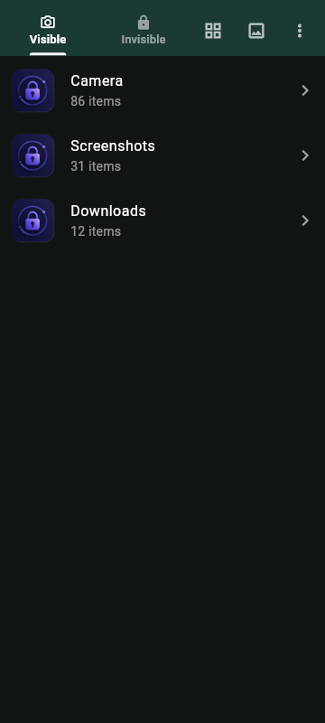
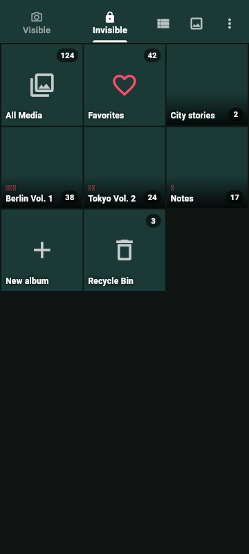
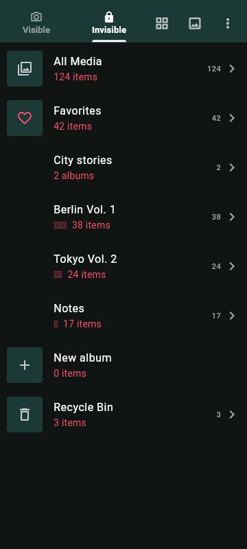
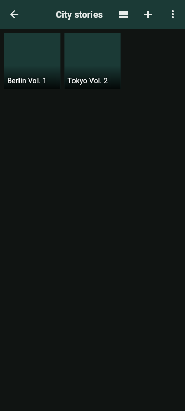
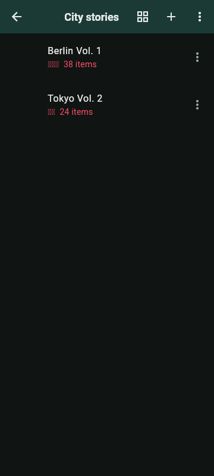
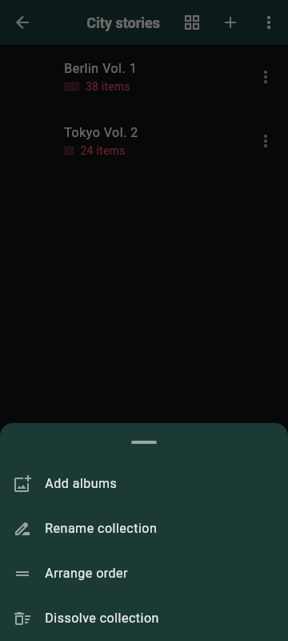
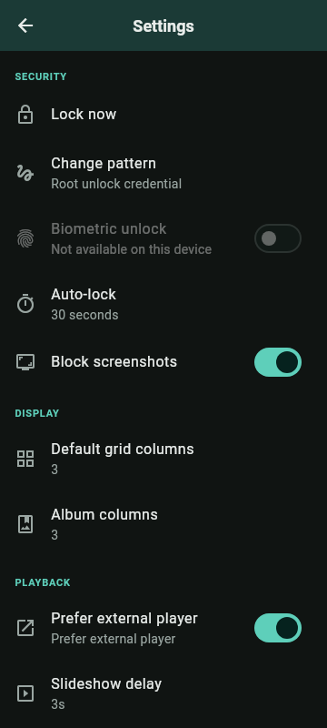
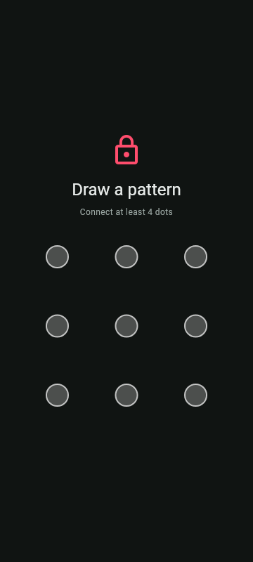

# Privi

[English](./README.md) · [简体中文](./README.zh-CN.md) · [繁體中文（香港）](./README.zh-HK.md)

个人使用、完全在设备上的 **Android 媒体保险库**。将照片和视频从系统相册中隐藏，支持 **1–3 颗红心**评分、收藏、播放列表（内置播放器或 **VLC**），以及**图案 / PIN + 生物识别**锁。仅支持深色主题。仅提供 APK 侧载，不使用云存储、账号或分析服务。

**作者：** [kcng0](https://github.com/kcng0) · **许可证：** [MIT](./LICENSE) · **支持：** [Buy Me a Coffee](https://buymeacoffee.com/kcng0)。

这是一个个人项目；优先保持简单，而不是堆叠功能。

---

## 安装（APK）

Privi 不发布到 Google Play。下载 Release APK 并侧载：

1. 打开最新的 **[Release](https://github.com/kcng0/privi/releases/latest)**。
2. 下载 `privi-<version>.apk`（可选下载 `SHA256SUMS`）。
3. 在电脑上校验下载文件：
   ```bash
   sha256sum -c SHA256SUMS
   ```
4. 如有提示，在手机上允许浏览器或文件管理器安装未知来源应用。
5. 打开 APK 并安装。

每个 Release 都包含：

| 文件 | 用途 |
|------|------|
| `privi-<version>.apk` | 侧载安装 |
| `SHA256SUMS` / `.sha256` / `CHECKSUMS.txt` | 完整性校验 |
| **Source code（zip / tar.gz）** | GitHub 根据 tag 自动附加 |

**要求：** Android 8.0+（API 26）。可选安装 [VLC](https://www.videolan.org/) 进行外部视频播放。所有媒体都保留在设备上。

> 官方 GitHub Release APK 使用**永久 Release 签名**（各版本使用同一密钥）。首次安装新签名时，Play Protect 可能显示“未知应用”提示；确认 **仍然安装**，并保持有害应用检测开启。

### 热更新

从 **v1.0.4** 起，更新完全由用户控制。打开 **设置 → 检查更新**，先检查最新稳定版 GitHub Release，再检查当前安装版本对应的 Shorebird 热更新通道。发现新的完整 Release 时，会显示确认操作并打开其 GitHub Release 页面；有签名 Dart 补丁时，Privi 会在下载前询问。自 **v1.0.5** 起，补丁下载成功后会自动重启 Privi，使补丁立即生效。关于页面显示基础版本/构建号和已应用的补丁编号。

Android/原生代码、插件、权限、内置资源和 Flutter 引擎变化仍需要新的 APK。v1.0.3 首次加入更新器但使用自动模式；安装一次 v1.0.5 可启用需要同意的更新和自动重启。网络访问只发生在手动检查之后，保险库媒体始终留在设备上。

---

## 功能

- **Visible | Invisible** 首页：浏览系统相册文件夹或私人保险库
- **独立的马赛克/列表视图**：每个首页页签分别记住自己的布局
- **隐藏文件夹**：从系统相册移除媒体，但保留磁盘文件
- **一致的高清封面**：隐藏前后使用同一张 768 px 视频帧
- **稳定的日期顺序**：隐藏后文件夹仍保持原始拍摄顺序
- **红心（0–3）**、收藏、相册排序和拖拽手动整理
- **合集**：创建、重命名、整理成员和无损解散
- **内置查看器/播放器**，以及带结果追踪的外部媒体应用
- **图案 / PIN + 生物识别**锁，可选 `FLAG_SECURE`（禁止截图）
- **根路由恢复锁**：覆盖所有页签/路由，仅追踪中的媒体应用返回可绕过
- 支持通过分享 Intent 导入图片和视频
- 媒体保存在设备上；签名更新检查由用户主动触发

### 关键词

`android photo vault` · `hide photos from gallery` · `private gallery app` ·
`video vault` · `offline media locker` · `pattern lock gallery` ·
`biometric photo lock` · `sideload apk vault` · `flutter media vault` ·
`hide videos android` · `no cloud gallery` · `vlc private player`

GitHub topics：`flutter` `android` `photo-vault` `video-vault` `private-gallery`
`hide-photos` `biometric-lock` `privacy` `offline` `sideload` `apk` `vlc` `mit-license`

---

## 截图

截图来自当前 **Privi v1.0.14** Flutter UI，使用合成的文件夹、相册、合集和内置应用图标生成。不使用个人媒体或连接设备；截图展示已发布的深色主题以及最新 Visible/Invisible/合集流程。

维护者无需 Android 设备即可重新生成：
`flutter test tool/readme_screenshots_test.dart --update-goldens`。

| Visible 马赛克 | Visible 列表 | Invisible 马赛克 |
|:--------------:|:------------:|:----------------:|
|  |  |  |

| Invisible 列表 | 合集马赛克 | 合集列表 |
|:--------------:|:--------:|:------:|
|  |  |  |

| 合集管理 | 设置 | 锁设置 |
|:--------:|:----:|:------:|
|  |  |  |

- **Visible 马赛克/列表**：按页签隔离保存的首页视图切换
- **Invisible 马赛克/列表**：保险库相册、评分、数量和合集
- **合集页面**：成员马赛克/列表视图及 CRUD 管理操作
- **设置/锁**：安全、显示、播放和首次图案设置

---

## 开发

### 前置要求

| 工具 | 说明 |
|------|------|
| Flutter **3.44.6** | 推荐使用 FVM（`.fvmrc` 固定精确版本） |
| JDK 17+ | Android Gradle |
| Android SDK | platform **37**、build-tools、cmdline-tools，且已接受 licenses |
| 设备 / 模拟器 | Android 8.0+（API 26） |

### Ubuntu / WSL2 一键设置

```bash
git clone https://github.com/kcng0/privi.git
cd privi

# 可选：安装 Flutter、Android SDK 和 licenses
./scripts/install-toolchain.sh && source ~/.bashrc

# 生成原生脚手架、依赖和代码
./scripts/bootstrap.sh

# 在已连接设备上运行
make run
```

### 日常命令

```bash
make run       # 在已连接设备上启动
make test      # 单元测试 + widget 测试
make analyze   # 静态分析
make format    # dart format lib test
make gen       # build_runner（Drift + Riverpod）
make watch     # 代码生成 watch 模式
make apk       # 生成用于侧载的 Release APK
make help      # 列出 Make 目标
```

不使用 `make` 时，可使用 `fvm flutter …`（未安装 FVM 则使用普通 `flutter`）。

完整环境说明、故障排查和 CI 细节见 **[DEVELOPMENT.md](./DEVELOPMENT.md)**。

### 仓库结构

```
├── lib/           # Dart 源码（按功能组织）
├── test/          # 单元测试和 widget 测试
├── android/       # Android 宿主工程
├── assets/        # 品牌 / 图标 / 截图
├── scripts/       # bootstrap + 工具链安装器
├── .github/       # CI + Release 工作流
├── pubspec.yaml
├── Makefile
└── DEVELOPMENT.md
```

---

## Release 与 CI

| 工作流 | 触发条件 | 内容 |
|--------|---------|------|
| [CI](./.github/workflows/ci.yaml) | push / PR 到 `main` | format、codegen、analyze、test |
| [Release](./.github/workflows/release.yml) | tag `v*` 或手动触发 | Shorebird 基础 APK、校验和与 GitHub Release |
| [Patch](./.github/workflows/patch.yml) | 在 `main` 上手动触发 | 现有基础版本的签名 Dart 补丁 |

从干净的 `main` 创建 Release：

```bash
# 修改 pubspec.yaml 版本（例如 0.1.0+1 → 0.1.1+2），提交后执行：
git tag v0.1.1
git push origin v0.1.1
```

也可以通过 **Actions → Release APK → Run workflow** 执行。只包含 Dart 代码的修复不需要新 APK，可通过 PR 合并后运行 **Actions → Shorebird Patch**，并指定准确的基础版本（例如 `1.0.4+5`）。

---

## 支持

如果 Privi 对你有帮助，可以在这里支持开发：

**[Buy Me a Coffee](https://buymeacoffee.com/kcng0)**

## 社区

- **[Linux do](https://linux.do)**

## 许可证

[MIT](./LICENSE) — Copyright (c) 2026 [kcng0](https://github.com/kcng0)。
